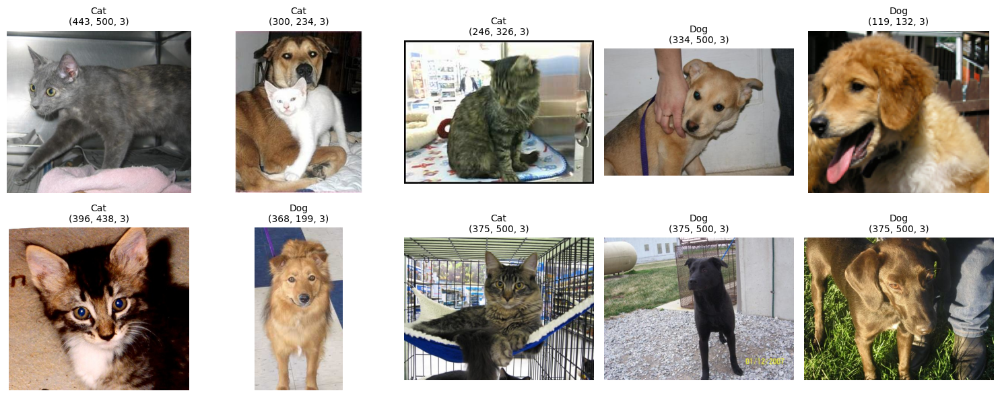
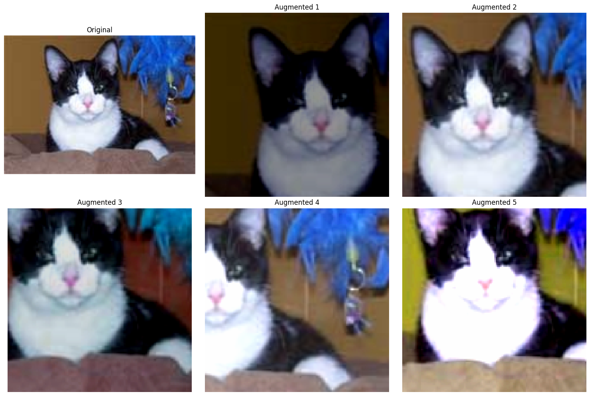
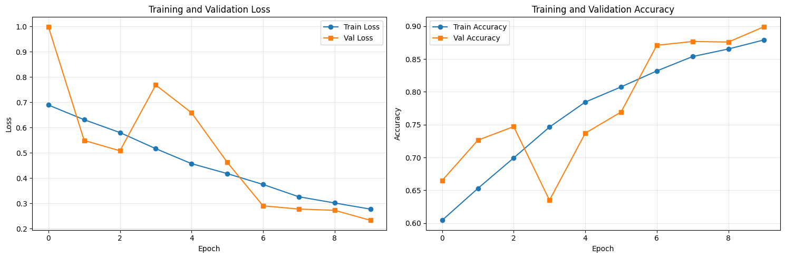
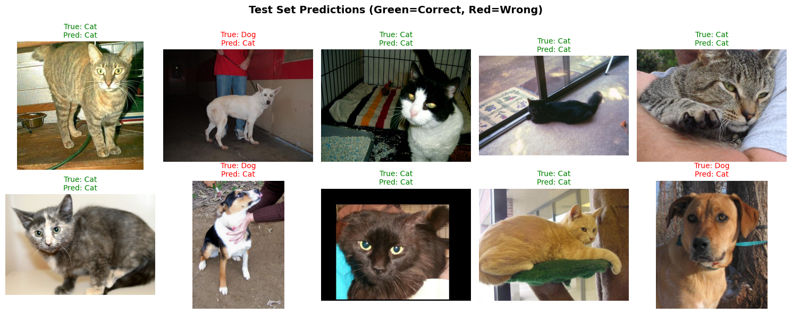

# Building a Cat vs Dog Classifier with PyTorch and Albumentations

## Overview

Image classification is one of the most fundamental tasks in computer vision, and building an effective classifier requires not just a good model architecture but also proper data preprocessing and augmentation techniques. In this tutorial, we'll walk through creating a binary image classifier that can distinguish between cats and dogs using PyTorch for the deep learning framework and Albumentations for image augmentations.

## What You'll Learn

- ✅ Set up a complete image classification pipeline with PyTorch
- ✅ Use Albumentations for image augmentations
- ✅ Implement proper data splitting and preprocessing
- ✅ Train a ResNet-50 model for binary classification
- ✅ Evaluate model performance and visualize predictions

## Why Image Classification Matters

### The Foundation of Computer Vision

Image classification is a fundamental task in computer vision and machine learning for several reasons.

### Why Start with Classification?

> **ℹ️ Note:** Classification is the most straightforward computer vision task. Unlike detection or segmentation, we don't need to determine **where** an object is located - we simply answer: **does it exist or not?**

#### Classification vs Other CV Tasks

| Task | What | Output | Complexity |
|------|------|--------|------------|
| **Classification** | Is there a cat or dog in this image? | Single label (cat/dog) | Simplest - just presence/absence |
| **Object Detection** | Where exactly is the cat/dog? | Bounding boxes + labels | Must locate objects spatially |
| **Semantic Segmentation** | Which pixels belong to the cat/dog? | Pixel-wise classification | Most complex - per-pixel decisions |

#### Why Classification is Ideal for Learning

✅ **Sufficient for Many Applications**: Often you just need to know if something exists (e.g., "Is this product defective?")  
✅ **Easiest Annotation Process**: Simply label images - no need to draw boxes or masks  
✅ **Simpler Loss Functions**: Binary cross-entropy is straightforward compared to multi-component losses in detection/segmentation  
✅ **Faster Convergence**: Simpler optimization landscape means models train more reliably  
✅ **Clear Success Metrics**: Accuracy is intuitive and easy to interpret

### Foundation for Complex Tasks

Once you master classification, you can build upon it:

- **Medical Diagnosis**: Classifies medical images to detect diseases, tumors, or abnormalities
- **Quality Control**: Identifies defective products in manufacturing lines
- **Content Moderation**: Filters inappropriate content automatically
- **Species Recognition**: Identifies animals, plants, or other organisms from photos

### Real-World Applications

The practical applications of image classification are vast and growing:

- **E-commerce**: Automatic product categorization and visual search
- **Security**: Facial recognition and surveillance systems
- **Agriculture**: Crop disease detection and yield prediction
- **Manufacturing**: Quality control and defect detection
- **Social Media**: Content moderation and automatic tagging

### Learning Transferable Features

Classification models learn hierarchical feature representations that transfer well to other tasks. The features learned from distinguishing cats and dogs (edges, textures, shapes) can be used for recognizing other animals, objects, or even abstract concepts.
## Why Albumentations?

- **Performance**: Optimized implementations that are significantly faster than alternatives
- **Variety**: Over 70 different augmentation techniques  
- **Flexibility**: Easy integration with PyTorch, TensorFlow, and other frameworks
- **Consistency**: Proper handling of bounding boxes, masks, and keypoints alongside images

## The Role of Data Augmentation

> **✅ Success:** In this tutorial, augmentation helped us achieve 87.9% validation accuracy with approximately 25,000 training images. Without augmentation, the same model typically plateaus at 75-80% validation accuracy while overfitting significantly (reaching 95%+ training accuracy).

Deep learning models need diverse data to generalize well. While collecting more labeled data is ideal, it's often impractical due to cost, scarcity, or expertise requirements.

### Why We Use Augmentation

Data augmentation artificially expands your training data diversity through label-preserving transformations:

✅ **Zero-cost diversity**: Generates unlimited variations on-the-fly during training  
✅ **Multiplicative effect**: Combining flips + rotations + brightness = thousands of unique variations per image  
✅ **Handles real-world variability**: Simulates viewpoint changes, lighting conditions, scale differences, and occlusions  
✅ **Prevents overfitting**: Forces models to learn general features instead of memorizing specific examples  
✅ **Solves distribution shift**: Widens training distribution to better match deployment conditions

### The Multiplication Effect

**One Image → Thousands of Variations**

Starting with 1 cat image:
- Add horizontal flip → 2 variations
- Add 4 rotations (0°, 90°, 180°, 270°) → 8 variations  
- Add 10 brightness levels → 80 variations
- Add 10 contrast levels → 800 variations
- Add random crops → many more variations

**Result**: Your model never sees the exact same image twice during training!

### Why Cats & Dogs Need Augmentation

- **Pose variations**: Cats curl up, dogs stand/sit/lie differently
- **Indoor/outdoor**: Drastically different lighting and backgrounds
- **Camera angles**: Pet photos taken from above, below, sideways
- **Partial views**: Often only see part of the animal
- **Different breeds**: Huge visual diversity within each class

### When to Augment vs Collect More Data

**Use Augmentation When:**
- ✓ Limited budget/time  
- ✓ Good quality existing data  
- ✓ Need specific variations (lighting, angles)  
- ✓ Training keeps overfitting

**Collect New Data When:**
- ✓ Missing entire categories  
- ✓ Domain shift (indoor cats → outdoor cats)  
- ✓ Current data is low quality  
- ✓ Legal/compliance requirements

### The Trade-offs

**Augmentation vs Data Collection**

**Augmentation Wins**:
- Immediate impact (no waiting for labeling)
- Especially useful for small datasets
- Precisely targets model weaknesses

**But Remember**:
- Acts as regularization - too much hurts performance
- Must match real-world variations, not create implausible images
- Can't replace domain-specific data (e.g., new medical conditions)

> **⚠️ Warning - Signs You're Over-Augmenting:**
> - Validation accuracy drops while training accuracy rises
> - Model struggles with normal, unaugmented test images
> - Training becomes extremely slow to converge
> - Augmented images look unrealistic to human eyes

### Quick Start Recipe

For image classification, start with this combination:

1. **Geometric**: Random crops + horizontal flips
2. **Color**: Slight brightness/contrast variations (limit=0.2)
3. **Start conservative**: Use p=0.3-0.5, increase if overfitting persists
4. **Validate clean**: Always validate on unaugmented data

## Dataset: Microsoft Cats vs Dogs

### Classic Binary Classification Dataset

We'll be working with the Microsoft Cats vs Dogs dataset, which contains thousands of images of cats and dogs. This dataset is suitable for learning binary classification as it provides clear visual distinctions between the two classes.

**Dataset Download**: [Microsoft Cats vs Dogs Dataset](https://download.microsoft.com/download/3/e/1/3e1c3f21-ecdb-4869-8368-6deba77b919f/kagglecatsanddogs_5340.zip)

### Dataset Examples

Here are some sample images from the dataset showing the variety of cats and dogs:



*Figure 1: Random samples from the Cats vs Dogs dataset showing various poses, lighting conditions, and backgrounds*
## Setting Up the Environment

First, let's import all the necessary libraries: 

**Required Imports:**
```python
import random
import shutil
from collections import defaultdict
from dataclasses import dataclass
from pathlib import Path
from typing import List, Optional, Tuple
from urllib.request import urlretrieve

import albumentations as A
import cv2
import matplotlib.pyplot as plt
import numpy as np
import torch
import torch.nn as nn
from albumentations.pytorch import ToTensorV2
from torch.backends import cudnn
from torch.utils.data import DataLoader, Dataset
from torchvision import models
from tqdm import tqdm

cudnn.benchmark = True
```

## Data Preparation and Splitting

One of the important aspects of any machine learning project is proper data handling. Our approach includes:

### 1. Data Download and Extraction

We create utility functions to download and extract the dataset:

**Download Utilities:**

<details>
<summary>Click to expand download utility functions</summary>

```python
class TqdmUpTo(tqdm):
    """Progress bar for downloads."""
    def update_to(self, b: int = 1, bsize: int = 1, tsize: Optional[int] = None) -> None:
        if tsize is not None:
            self.total = tsize
        self.update(b * bsize - self.n)

def download_and_extract(url: str, data_dir: Path) -> Path:
    """Download and extract the dataset."""
    data_dir.mkdir(parents=True, exist_ok=True)
    filepath = data_dir / "kagglecatsanddogs_5340.zip"
    
    if not filepath.exists():
        print(f"📥 Downloading dataset to {filepath}")
        with TqdmUpTo(unit="B", unit_scale=True, unit_divisor=1024, miniters=1,
                      desc=filepath.name) as t:
            urlretrieve(url, filename=filepath, reporthook=t.update_to)
            t.total = t.n
    else:
        print("✅ Dataset already downloaded.")
    
    extract_dir = data_dir / "PetImages"
    if not extract_dir.exists():
        print("📦 Extracting dataset...")
        shutil.unpack_archive(filepath, data_dir)
    
    return extract_dir
```

</details>

**Download and Extract Dataset:**
```python
# Configuration
data_dir = Path.home() / "datasets" / "cats-vs-dogs"

# Download the dataset
dataset_url = "https://download.microsoft.com/download/3/e/1/3e1c3f21-ecdb-4869-8368-6deba77b919f/kagglecatsanddogs_5340.zip"

# Download and extract
extract_dir = download_and_extract(dataset_url, data_dir)
print(f"Dataset extracted to: {extract_dir}")
```

### 2. Data Quality Control

> **ℹ️ Info:** Not all images in the dataset are valid. We implement a quality check using OpenCV to ensure training stability.

**Image Validation:**

<details>
<summary>Click to expand image validation function</summary>

```python
def load_and_validate_images(data_dir: Path) -> Tuple[List[Path], List[str]]:
    """Load image paths and validate them."""
    cat_dir = data_dir / "Cat"
    dog_dir = data_dir / "Dog"
    
    cat_images = list(cat_dir.glob("*.jpg"))
    dog_images = list(dog_dir.glob("*.jpg"))
    
    valid_images = []
    labels = []
    
    print("🔍 Validating images...")
    for img_path in tqdm(cat_images + dog_images, desc="Checking images"):
        img = cv2.imread(str(img_path))
        if img is not None:
            valid_images.append(img_path)
            labels.append("Cat" if img_path.parent.name == "Cat" else "Dog")
    
    print(f"✅ Found {len(valid_images)} valid images out of {len(cat_images) + len(dog_images)} total")
    return valid_images, labels
```

</details>

```python
# Validate images
image_paths, labels = load_and_validate_images(extract_dir)
```

### 3. Strategic Data Splitting

We split our data into three sets using a flexible splitting function:

**Improved Data Splitting Function:**

<details>
<summary>Click to expand data splitting function</summary>

```python
def split_dataset(
    image_paths: List[Path], 
    labels: List[str], 
    val_split: float = 0.2, 
    test_size: int = 10, 
    seed: int = 42
) -> Tuple[List[Path], List[Path], List[Path]]:
    """Split dataset into train, validation, and test sets."""
    random.seed(seed)
    
    combined = list(zip(image_paths, labels))
    random.shuffle(combined)
    image_paths, labels = zip(*combined)
    
    total_size = len(image_paths)
    test_size = min(test_size, total_size // 10)  # Max 10% for test
    val_size = int((total_size - test_size) * val_split)
    train_size = total_size - val_size - test_size
    
    train_paths = list(image_paths[:train_size])
    val_paths = list(image_paths[train_size:train_size + val_size])
    test_paths = list(image_paths[train_size + val_size:])
    
    print(f"📊 Dataset split: Train={len(train_paths)}, Val={len(val_paths)}, Test={len(test_paths)}")
    return train_paths, val_paths, test_paths
```

</details>

```python
# Split the dataset
train_paths, val_paths, test_paths = split_dataset(image_paths, labels)
```

## Creating the PyTorch Dataset

Our custom dataset class handles the binary classification task by converting image paths to tensors and labels:

**Custom Dataset Class:**
```python
class CatsVsDogsDataset(Dataset):
    """PyTorch dataset for Cats vs Dogs classification."""
    
    def __init__(self, image_paths: List[Path], transform=None):
        self.image_paths = image_paths
        self.transform = transform

    def __len__(self) -> int:
        return len(self.image_paths)

    def __getitem__(self, idx: int) -> Tuple[torch.Tensor, float]:
        img_path = self.image_paths[idx]
        
        image = cv2.imread(str(img_path), cv2.IMREAD_COLOR)
        image = cv2.cvtColor(image, cv2.COLOR_BGR2RGB)
        
        label = 1.0 if img_path.parent.name == "Cat" else 0.0
        if self.transform is not None:
            image = self.transform(image=image)["image"]
        
        return image, label
```

## Augmentation Strategies with Albumentations

Here we create different augmentation pipelines for training and validation.

### Training Augmentations

For training, we apply various augmentations to increase data diversity and improve model generalization:

**Training Transform Pipeline:**
```python
train_transform = A.Compose([
    A.SmallestMaxSize(max_size=160),
    A.Affine(shift_limit=0.05, scale_limit=0.05, rotate_limit=15, p=0.5),
    A.RandomCrop(height=128, width=128),
    A.ColorJitter(brightness=0.2, contrast=0.2, saturation=0.2, hue=0.1, p=0.5),
    A.RandomBrightnessContrast(p=0.5),
    A.Normalize(mean=(0.485, 0.456, 0.406), std=(0.229, 0.224, 0.225)),
    ToTensorV2(),
])
```

### Key Augmentations Explained

#### SmallestMaxSize
- **Transform**: `SmallestMaxSize(max_size=160)`
- **Purpose**: Resizes images while maintaining aspect ratio
- **Benefit**: Handles images of varying dimensions without distortion

#### Affine
- **Transform**: `Affine(shift_limit=0.05, scale_limit=0.05, rotate_limit=15, p=0.5)`
- **Purpose**: Applies geometric transformations
- **Why**: Real-world photos are rarely perfectly aligned or scaled
- **Benefit**: Makes the model handle camera angles, distance variations, and slight rotations
- **Parameters**: Small limits prevent unrealistic distortions while adding useful variance

#### RandomCrop
- **Transform**: `RandomCrop(height=128, width=128)`
- **Purpose**: Creates spatial variations by cropping different regions
- **Why**: Animals can appear anywhere in an image, not just centered
- **Benefit**: Teaches the model to recognize cats/dogs regardless of their position in the frame
- **Impact**: Forces the model to learn from partial views and different compositions

#### ColorJitter
- **Transform**: `ColorJitter(brightness=0.2, contrast=0.2, saturation=0.2, hue=0.1, p=0.5)`
- **Purpose**: Adjusts color channels independently
- **Why**: Different cameras, lighting conditions, and image processing create color variations
- **Benefit**: Reduces overfitting to specific color profiles
- **Real-world relevance**: Handles photos taken with different devices or under various lighting

#### RandomBrightnessContrast
- **Transform**: `RandomBrightnessContrast(p=0.5)`
- **Purpose**: Modifies lighting conditions
- **Why**: Photos are taken under vastly different lighting conditions (indoor, outdoor, flash, etc.)
- **Benefit**: Ensures the model relies on shape and texture rather than brightness
- **Robustness**: Important for deployment where lighting conditions are unpredictable

#### Normalize
- **Transform**: `Normalize(mean=(0.485, 0.456, 0.406), std=(0.229, 0.224, 0.225))`
- **Purpose**: Standardizes pixel values using ImageNet statistics
- **Why**: Neural networks train better with normalized inputs
- **Benefit**: Faster convergence and more stable training
- **Transfer learning**: Using ImageNet statistics enables better transfer from pre-trained models

### Augmentation in Action

Here's how our augmentations transform a single image:



*Figure 2: Original image and five augmented versions showing the variety of transformations applied*

### The Science Behind Augmentation Choices

Each augmentation addresses specific challenges in real-world deployment:

- **Geometric Augmentations** (rotation, scaling, cropping): Address viewpoint variations and ensure spatial invariance
- **Photometric Augmentations** (brightness, contrast, color shifts): Handle lighting and camera sensor differences
- **Spatial Augmentations** (crops, flips): Teach positional invariance and handle occlusions

> **ℹ️ Info:** The probability values (p=0.5) mean each augmentation is applied to only 50% of images, creating a balanced mix of original and augmented data. This prevents the model from only seeing heavily modified images while still providing sufficient variation.

### Validation Augmentations

For validation, we use deterministic transformations to ensure consistent evaluation:

**Validation Transform Pipeline:**
```python
val_transform = A.Compose([
    A.SmallestMaxSize(max_size=160),
    A.CenterCrop(height=128, width=128),  # Deterministic crop
    A.Normalize(mean=(0.485, 0.456, 0.406), std=(0.229, 0.224, 0.225)),
    ToTensorV2(),
])
```

### Why Minimal Validation Augmentations?

### Validation Best Practices

The validation pipeline intentionally uses minimal, deterministic transformations. This approach follows the principle that training should be diverse and challenging, while validation should be consistent and representative of real-world inference conditions.

- **Consistent Evaluation**: Random augmentations would make validation scores inconsistent across runs
- **True Performance Measurement**: We want to measure how well the model performs on "clean" data
- **Hyperparameter Tuning**: Consistent validation scores enable reliable comparison of different model configurations
- **CenterCrop vs RandomCrop**: Center cropping ensures we always evaluate the same region, removing randomness from performance metrics

## Model Architecture and Training Setup

We use ResNet-50, a common architecture for image classification:

**Model Configuration:**
```python
# Configuration using dataclass
@dataclass
class Config:
    """Training configuration."""
    model_name: str = "resnet50"  # Can be: resnet18, resnet34, resnet50
    device: str = "cuda" if torch.cuda.is_available() else "cpu"
    learning_rate: float = 0.001
    batch_size: int = 64
    num_workers: int = 4
    epochs: int = 10
    image_size: int = 128
    val_split: float = 0.2
    test_size: int = 10
    seed: int = 42
    save_dir: Path = Path("checkpoints")
    data_dir: Path = Path.home() / "datasets" / "cats-vs-dogs"

# Create model function
def create_model(config: Config) -> nn.Module:
    """Create and initialize the model."""
    if config.model_name.startswith('resnet'):
        model = getattr(models, config.model_name)(weights=None)
        num_features = model.fc.in_features
        model.fc = nn.Linear(num_features, 1)
    elif config.model_name.startswith('efficientnet'):
        model = getattr(models, config.model_name)(weights=None)
        num_features = model.classifier[1].in_features
        model.classifier[1] = nn.Linear(num_features, 1)
    else:
        raise ValueError(f"Unsupported model: {config.model_name}")
    
    return model.to(config.device)
```


## Training Pipeline with Monitoring

We implement training and validation functions with monitoring:

**Helper Classes and Functions:**
```python
class MetricMonitor:
    def __init__(self, float_precision=3):
        self.float_precision = float_precision
        self.reset()

    def reset(self):
        self.metrics = defaultdict(lambda: {"val": 0, "count": 0, "avg": 0})

    def update(self, metric_name, val):
        metric = self.metrics[metric_name]
        metric["val"] += val
        metric["count"] += 1
        metric["avg"] = metric["val"] / metric["count"]

    def __str__(self):
        return " | ".join(
            [f"{metric_name}: {metric['avg']:.{self.float_precision}f}"
             for (metric_name, metric) in self.metrics.items()]
        )

def calculate_accuracy(output, target):
    prediction = torch.sigmoid(output) >= 0.5
    correct = (prediction == target).sum().item()
    accuracy = correct / output.shape[0]
    return accuracy

class EarlyStopping:
    """Early stopping to prevent overfitting."""
    
    def __init__(self, patience: int = 5, min_delta: float = 0.001):
        self.patience = patience
        self.min_delta = min_delta
        self.counter = 0
        self.best_loss = None
        self.early_stop = False
    
    def __call__(self, val_loss: float) -> bool:
        if self.best_loss is None:
            self.best_loss = val_loss
        elif val_loss > self.best_loss - self.min_delta:
            self.counter += 1
            if self.counter >= self.patience:
                self.early_stop = True
        else:
            self.best_loss = val_loss
            self.counter = 0
        
        return self.early_stop
```

**Create Data Loaders:**
```python
# Create datasets
train_dataset = CatsVsDogsDataset(train_paths, transform=train_transform)
val_dataset = CatsVsDogsDataset(val_paths, transform=val_transform)

# Create data loaders
config = Config()
train_loader = DataLoader(
    train_dataset,
    batch_size=config.batch_size,
    shuffle=True,
    num_workers=config.num_workers,
    pin_memory=True,
)

val_loader = DataLoader(
    val_dataset,
    batch_size=config.batch_size,
    shuffle=False,
    num_workers=config.num_workers,
    pin_memory=True,
)
```

**Training Function:**
```python
def train_epoch(
    train_loader: DataLoader,
    model: nn.Module,
    criterion: nn.Module,
    optimizer: torch.optim.Optimizer,
    epoch: int,
    device: str
) -> Tuple[float, float]:
    """Train for one epoch."""
    metric_monitor = MetricMonitor()
    model.train()
    stream = tqdm(train_loader, desc=f"Epoch {epoch} [Train]")
    
    for images, targets in stream:
        images = images.to(device, non_blocking=True)
        targets = targets.to(device, non_blocking=True).float().view(-1, 1)
        
        # Forward pass
        outputs = model(images)
        loss = criterion(outputs, targets)
        accuracy = calculate_accuracy(outputs, targets)
        
        # Backward pass
        optimizer.zero_grad()
        loss.backward()
        optimizer.step()
        
        # Update metrics
        metric_monitor.update("Loss", loss.item())
        metric_monitor.update("Accuracy", accuracy)
        stream.set_postfix_str(str(metric_monitor))
    
    return metric_monitor.metrics["Loss"]["avg"], metric_monitor.metrics["Accuracy"]["avg"]
```

**Validation Function:**
```python
def validate_epoch(
    val_loader: DataLoader,
    model: nn.Module,
    criterion: nn.Module,
    epoch: int,
    device: str
) -> Tuple[float, float]:
    """Validate for one epoch."""
    metric_monitor = MetricMonitor()
    model.eval()
    stream = tqdm(val_loader, desc=f"Epoch {epoch} [Val]")
    
    with torch.inference_mode():
        for images, targets in stream:
            images = images.to(device, non_blocking=True)
            targets = targets.to(device, non_blocking=True).float().view(-1, 1)
            
            outputs = model(images)
            loss = criterion(outputs, targets)
            accuracy = calculate_accuracy(outputs, targets)
            
            metric_monitor.update("Loss", loss.item())
            metric_monitor.update("Accuracy", accuracy)
            stream.set_postfix_str(str(metric_monitor))
    
    return metric_monitor.metrics["Loss"]["avg"], metric_monitor.metrics["Accuracy"]["avg"]
```

**Training Loop:**
```python
# Initialize training components
config = Config()
model = create_model(config)
criterion = nn.BCEWithLogitsLoss()
optimizer = torch.optim.Adam(model.parameters(), lr=config.learning_rate)
scheduler = torch.optim.lr_scheduler.ReduceLROnPlateau(
    optimizer, mode='min', factor=0.5, patience=3, verbose=True
)

# Training history
history = {
    "train_loss": [], "train_acc": [],
    "val_loss": [], "val_acc": []
}

best_val_acc = 0.0
config.save_dir.mkdir(exist_ok=True)

# Initialize early stopping
early_stopping = EarlyStopping(patience=5)

# Training loop
for epoch in range(1, config.epochs + 1):
    train_loss, train_acc = train_epoch(
        train_loader, model, criterion, optimizer, epoch, config.device
    )
    
    val_loss, val_acc = validate_epoch(
        val_loader, model, criterion, epoch, config.device
    )
    
    # Update history
    history["train_loss"].append(train_loss)
    history["train_acc"].append(train_acc)
    history["val_loss"].append(val_loss)
    history["val_acc"].append(val_acc)
    
    # Update learning rate
    scheduler.step(val_loss)
    
    # Save best model
    if val_acc > best_val_acc:
        best_val_acc = val_acc
        torch.save({
            'epoch': epoch,
            'model_state_dict': model.state_dict(),
            'optimizer_state_dict': optimizer.state_dict(),
            'val_acc': val_acc,
            'val_loss': val_loss,
        }, config.save_dir / 'best_model.pth')
        print(f"  → Saved best model (val_acc: {val_acc:.4f})")
    
    # Early stopping check
    if early_stopping(val_loss):
        print(f"\nEarly stopping triggered at epoch {epoch}")
        break
    
    print(f"Epoch {epoch}/{config.epochs}: Train Loss: {train_loss:.4f}, "
          f"Train Acc: {train_acc:.4f}, Val Loss: {val_loss:.4f}, Val Acc: {val_acc:.4f}")
```

## Results and Performance

**📊 Results**

After training for 10 epochs, our model achieves these results:

- **Final Training Accuracy**: 87.93%
- **Final Validation Accuracy**: 89.94%
- **Training Loss**: Decreased from 0.683 to 0.278
- **Validation Loss**: Decreased from 0.696 to 0.233

### Training Progress



*Figure 3: Training and validation loss/accuracy curves showing smooth convergence without overfitting*

The consistent improvement in both training and validation metrics indicates that the model is learning without overfitting.

## Model Inference and Visualization

For inference, we create a separate dataset class and apply the same preprocessing as validation:

**Visualization Function:**
```python
def display_image_grid(images_filepaths, predicted_labels=(), cols=5):
    rows = len(images_filepaths) // cols
    _, ax = plt.subplots(nrows=rows, ncols=cols, figsize=(12, 6))
    for i, image_filepath in enumerate(images_filepaths):
        image = cv2.imread(image_filepath, cv2.IMREAD_COLOR_RGB)

        true_label = os.path.normpath(image_filepath).split(os.sep)[-2]
        predicted_label = predicted_labels[i] if predicted_labels else true_label
        color = "green" if true_label == predicted_label else "red"
        ax.ravel()[i].imshow(image)
        ax.ravel()[i].set_title(predicted_label, color=color)
        ax.ravel()[i].set_axis_off()
    plt.tight_layout()
    plt.show()
```

**Inference Dataset Class:**
```python
class CatsVsDogsInferenceDataset(Dataset):
    def __init__(self, images_filepaths, transform=None):
        self.images_filepaths = images_filepaths
        self.transform = transform

    def __len__(self):
        return len(self.images_filepaths)

    def __getitem__(self, idx):
        image_filepath = self.images_filepaths[idx]
        image = cv2.imread(image_filepath)
        image = cv2.cvtColor(image, cv2.COLOR_BGR2RGB)
        if self.transform is not None:
            image = self.transform(image=image)["image"]
        return image
```

**Run Inference:**
```python
# Create test dataset and loader
test_transform = val_transform  # Use the same transform as validation
test_dataset = CatsVsDogsInferenceDataset(images_filepaths=test_paths, transform=test_transform)
test_loader = DataLoader(
    test_dataset,
    batch_size=config.batch_size,
    shuffle=False,
    num_workers=config.num_workers,
    pin_memory=True,
)

# Make predictions
model.eval()
predicted_labels = []
with torch.inference_mode():
    for images in test_loader:
        images = images.to(config.device, non_blocking=True)
        output = model(images)
        predictions = (torch.sigmoid(output) >= 0.5)[:, 0].cpu().numpy()
        predicted_labels += ["Cat" if is_cat else "Dog" for is_cat in predictions]

# Display results
visualizer = Visualizer()
visualizer.display_predictions(test_paths, predicted_labels)
```

### Model Predictions

Here are the model's predictions on our test set:




*Figure 4: Test set predictions. Green titles indicate correct predictions, red titles indicate misclassifications*

## Key Takeaways and Best Practices

### 1. Data Quality Matters

### Data Validation

Always validate your data. In our case, filtering out corrupted images improved training stability.

⚠️ **Important considerations:**
- **Impact**: Corrupted images can cause training crashes or introduce noise
- **Solution**: Implement data validation pipelines to catch issues early
- **Best Practice**: Always inspect a sample of your data before training

### 2. Augmentation Strategy

The choice and intensity of augmentations should match your deployment scenario:

- **Training**: Use various augmentations to improve generalization and simulate real-world conditions
- **Validation**: Keep augmentations minimal and deterministic for consistent evaluation
- **Testing**: Apply the same preprocessing as validation for fair comparison
- **Production**: Consider the types of variations your model will encounter in real deployment

### 3. Classification as a Learning Foundation

Binary classification like cats vs dogs teaches fundamental concepts:

✅ **Key learnings:**
- **Feature Learning**: Models learn to detect edges, textures, shapes, and complex patterns
- **Decision Boundaries**: Understanding how models separate classes in feature space
- **Evaluation Metrics**: Accuracy, precision, recall, and their trade-offs
- **Transfer Learning**: Features learned here transfer to other animal classification tasks

### 4. Benefits of Binary Classification

- **Simplicity**: Easier to debug and understand model behavior
- **Baseline**: Establishes performance benchmarks before tackling multi-class problems
- **Interpretability**: Clear decision boundaries make it easier to analyze what the model learned
- **Practical Applications**: Many real-world problems are binary (spam/not spam, defective/good, etc.)

### 5. Monitoring

Implement logging to track training progress and detect issues early:

- **Loss Curves**: Monitor both training and validation loss for overfitting signs
- **Accuracy Trends**: Ensure both metrics improve together
- **Learning Rate**: Adjust based on loss plateau or oscillation patterns

### 6. Proper Evaluation

ℹ️ **Best practices:**
- Use separate test sets for final evaluation
- Visualize predictions to understand model behavior
- Monitor both training and validation metrics
- **Confusion Matrix**: Understand which classes are confused with each other
- **Error Analysis**: Examine misclassified examples to identify improvement areas


## Complete Training Script

Here's an improved version of the complete script with modern Python practices:

<details>
<summary><strong>🔽 Click to expand the complete training script</strong></summary>

```python
import random
import shutil
from collections import defaultdict
from dataclasses import dataclass
from pathlib import Path
from typing import List, Optional, Tuple
from urllib.request import urlretrieve

import albumentations as A
import cv2
import matplotlib.pyplot as plt
import numpy as np
import torch
import torch.nn as nn
from albumentations.pytorch import ToTensorV2
from torch.backends import cudnn
from torch.utils.data import DataLoader, Dataset
from torchvision import models
from tqdm import tqdm

cudnn.benchmark = True

# Configuration
@dataclass
class Config:
    """Training configuration with common defaults."""
    model_name: str = "resnet50"  # Can be: resnet18, resnet34, resnet50, efficientnet_b0
    device: str = "cuda" if torch.cuda.is_available() else "cpu"
    learning_rate: float = 0.001  # Starting LR for Adam optimizer
    batch_size: int = 64  # Reduce if GPU memory issues
    num_workers: int = 4  # Set to 0 on Windows if multiprocessing issues
    epochs: int = 10  # Increase for better accuracy
    image_size: int = 128  # Balance between speed and accuracy
    val_split: float = 0.2  # 80/20 train/val split
    test_size: int = 10  # Small test set for demo
    seed: int = 42  # For reproducibility
    save_dir: Path = Path("checkpoints")
    data_dir: Path = Path.home() / "datasets" / "cats-vs-dogs"
    
    def __post_init__(self):
        """Validate and adjust configuration."""
        # Auto-disable AMP on CPU
        if self.device == "cpu":
            self.use_amp = False
        
        # Create directories
        self.save_dir.mkdir(exist_ok=True)
        
class DataManager:
    """Encapsulates all data-related operations."""
    
    def __init__(self, config: Config):
        self.config = config
        self.data_dir = config.data_dir
        self.seed = config.seed
        
    class TqdmUpTo(tqdm):
        """Progress bar for downloads."""
        def update_to(self, b: int = 1, bsize: int = 1, tsize: Optional[int] = None) -> None:
            if tsize is not None:
                self.total = tsize
            self.update(b * bsize - self.n)

    def download_and_extract(self, url: str) -> Path:
        """Download and extract the dataset."""
        self.data_dir.mkdir(parents=True, exist_ok=True)
        filepath = self.data_dir / "kagglecatsanddogs_5340.zip"
        
        if not filepath.exists():
            print(f"📥 Downloading dataset to {filepath}")
            with self.TqdmUpTo(unit="B", unit_scale=True, unit_divisor=1024, miniters=1, 
                          desc=filepath.name) as t:
                urlretrieve(url, filename=filepath, reporthook=t.update_to)
                t.total = t.n
        else:
            print("✅ Dataset already downloaded.")
        
        extract_dir = self.data_dir / "PetImages"
        if not extract_dir.exists():
            print("📦 Extracting dataset...")
            shutil.unpack_archive(filepath, self.data_dir)
        
        return extract_dir
    
    def load_and_validate_images(self, data_dir: Path) -> Tuple[List[Path], List[str]]:
        """Load image paths and validate them."""
        cat_dir = data_dir / "Cat"
        dog_dir = data_dir / "Dog"
        
        cat_images = list(cat_dir.glob("*.jpg"))
        dog_images = list(dog_dir.glob("*.jpg"))
        
        valid_images = []
        labels = []
        
        print("🔍 Validating images...")
        for img_path in tqdm(cat_images + dog_images, desc="Checking images"):
            img = cv2.imread(str(img_path))
            if img is not None:
                valid_images.append(img_path)
                labels.append("Cat" if img_path.parent.name == "Cat" else "Dog")
        
        print(f"✅ Found {len(valid_images)} valid images out of {len(cat_images) + len(dog_images)} total")
        return valid_images, labels
    
    def split_dataset(
        self, 
        image_paths: List[Path], 
        labels: List[str]
    ) -> Tuple[List[Path], List[Path], List[Path]]:
        """Split dataset into train, validation, and test sets."""
        random.seed(self.seed)
        
        combined = list(zip(image_paths, labels))
        random.shuffle(combined)
        image_paths, labels = zip(*combined)
        
        total_size = len(image_paths)
        test_size = min(self.config.test_size, total_size // 10)  # Max 10% for test
        val_size = int((total_size - test_size) * self.config.val_split)
        train_size = total_size - val_size - test_size
        
        train_paths = list(image_paths[:train_size])
        val_paths = list(image_paths[train_size:train_size + val_size])
        test_paths = list(image_paths[train_size + val_size:])
        
        print(f"📊 Dataset split: Train={len(train_paths)}, Val={len(val_paths)}, Test={len(test_paths)}")
        return train_paths, val_paths, test_paths
    
    def prepare_data(self) -> Tuple[List[Path], List[Path], List[Path]]:
        """Complete data preparation pipeline."""
        dataset_url = "https://download.microsoft.com/download/3/e/1/3e1c3f21-ecdb-4869-8368-6deba77b919f/kagglecatsanddogs_5340.zip"
        data_dir = self.download_and_extract(dataset_url)
        image_paths, labels = self.load_and_validate_images(data_dir)
        return self.split_dataset(image_paths, labels)


class Visualizer:
    """Handles all visualization tasks."""
    
    @staticmethod
    def show_dataset_samples(image_paths: List[Path], num_samples: int = 10):
        """Display sample images from the dataset."""
        fig, axes = plt.subplots(2, 5, figsize=(15, 6))
        axes = axes.ravel()
        
        sample_paths = random.sample(image_paths, min(num_samples, len(image_paths)))
        
        for idx, img_path in enumerate(sample_paths):
            img = cv2.imread(str(img_path))
            img = cv2.cvtColor(img, cv2.COLOR_BGR2RGB)
            
            axes[idx].imshow(img)
            axes[idx].set_title(f"{img_path.parent.name}\n{img.shape}", fontsize=10)
            axes[idx].axis('off')
        
        plt.tight_layout()
        plt.savefig('dataset_samples.png', dpi=150, bbox_inches='tight')
        plt.show()
    
    @staticmethod
    def show_augmented_samples(image_path: Path, transform, num_samples: int = 6):
        """Show original and augmented versions of an image."""
        img = cv2.imread(str(image_path))
        img = cv2.cvtColor(img, cv2.COLOR_BGR2RGB)
        
        viz_transform = A.Compose([
            t for t in transform.transforms 
            if not isinstance(t, (A.Normalize, ToTensorV2))
        ])
        
        fig, axes = plt.subplots(2, 3, figsize=(15, 10))
        axes = axes.ravel()
        
        axes[0].imshow(img)
        axes[0].set_title("Original", fontsize=12)
        axes[0].axis('off')
        
        for idx in range(1, num_samples):
            augmented = viz_transform(image=img)["image"]
            axes[idx].imshow(augmented)
            axes[idx].set_title(f"Augmented {idx}", fontsize=12)
            axes[idx].axis('off')
        
        plt.tight_layout()
        plt.savefig('augmentation_examples.png', dpi=150, bbox_inches='tight')
        plt.show()
    
    @staticmethod
    def plot_training_history(history: dict, save_path: Path = Path("training_history.png")):
        """Plot training and validation metrics."""
        fig, (ax1, ax2) = plt.subplots(1, 2, figsize=(15, 5))
        
        ax1.plot(history["train_loss"], label="Train Loss", marker='o')
        ax1.plot(history["val_loss"], label="Val Loss", marker='s')
        ax1.set_xlabel("Epoch")
        ax1.set_ylabel("Loss")
        ax1.set_title("Training and Validation Loss")
        ax1.legend()
        ax1.grid(True, alpha=0.3)
        
        ax2.plot(history["train_acc"], label="Train Accuracy", marker='o')
        ax2.plot(history["val_acc"], label="Val Accuracy", marker='s')
        ax2.set_xlabel("Epoch")
        ax2.set_ylabel("Accuracy")
        ax2.set_title("Training and Validation Accuracy")
        ax2.legend()
        ax2.grid(True, alpha=0.3)
        
        plt.tight_layout()
        plt.savefig(save_path, dpi=150, bbox_inches='tight')
        plt.show()
    
    @staticmethod
    def display_predictions(image_paths: List[Path], predicted_labels: List[str], cols: int = 5):
        """Display images with predicted labels."""
        rows = len(image_paths) // cols
        fig, axes = plt.subplots(rows, cols, figsize=(15, 6))
        axes = axes.ravel()
        
        for i, image_path in enumerate(image_paths):
            img = cv2.imread(str(image_path))
            img = cv2.cvtColor(img, cv2.COLOR_BGR2RGB)
            
            true_label = image_path.parent.name
            predicted_label = predicted_labels[i]
            color = "green" if true_label == predicted_label else "red"
            
            axes[i].imshow(img)
            axes[i].set_title(f"Pred: {predicted_label}", color=color)
            axes[i].axis('off')
        
        plt.tight_layout()
        plt.savefig('predictions_results.png', dpi=150, bbox_inches='tight')
        plt.show()

class CatsVsDogsDataset(Dataset):
    """Optimized PyTorch dataset with optional caching for faster training."""
    
    def __init__(self, image_paths: List[Path], transform=None, cache_images: bool = False):
        self.image_paths = image_paths
        self.transform = transform
        self.cache_images = cache_images
        self.image_cache = {}
        
        if cache_images:
            print(f"📦 Caching {len(image_paths)} images in memory...")
            for idx, path in enumerate(tqdm(image_paths, desc="Loading images")):
                img = cv2.imread(str(path), cv2.IMREAD_COLOR)
                if img is not None:
                    img = cv2.cvtColor(img, cv2.COLOR_BGR2RGB)
                    self.image_cache[idx] = img
    
    def __len__(self) -> int:
        return len(self.image_paths)
    
    def __getitem__(self, idx: int) -> Tuple[torch.Tensor, float]:
        img_path = self.image_paths[idx]
        
        if self.cache_images and idx in self.image_cache:
            image = self.image_cache[idx].copy()  # Copy to avoid modifying cache
        else:
            image = cv2.imread(str(img_path), cv2.IMREAD_COLOR)
            image = cv2.cvtColor(image, cv2.COLOR_BGR2RGB)
        
        label = 1.0 if img_path.parent.name == "Cat" else 0.0        
        if self.transform is not None:
            image = self.transform(image=image)["image"]
        
        return image, label

# Define transforms
train_transform = A.Compose([
    A.SmallestMaxSize(max_size=160),
    A.Affine(shift_limit=0.05, scale_limit=0.05, rotate_limit=15, p=0.5),
    A.RandomCrop(height=128, width=128),
    A.ColorJitter(brightness=0.2, contrast=0.2, saturation=0.2, hue=0.1, p=0.5),
    A.RandomBrightnessContrast(p=0.5),
    A.Normalize(mean=(0.485, 0.456, 0.406), std=(0.229, 0.224, 0.225)),
    ToTensorV2(),
])

val_transform = A.Compose([
    A.SmallestMaxSize(max_size=160),
    A.CenterCrop(height=128, width=128),
    A.Normalize(mean=(0.485, 0.456, 0.406), std=(0.229, 0.224, 0.225)),
    ToTensorV2(),
])

# Create model with better initialization
def create_model(config: Config) -> nn.Module:
    """Create and initialize the model."""
    # Try different architectures easily
    if config.model_name.startswith('resnet'):
        model = getattr(models, config.model_name)(weights=None)  # Use 'weights' instead of deprecated 'pretrained'
        num_features = model.fc.in_features
        model.fc = nn.Linear(num_features, 1)
    elif config.model_name.startswith('efficientnet'):
        model = getattr(models, config.model_name)(weights=None)
        num_features = model.classifier[1].in_features
        model.classifier[1] = nn.Linear(num_features, 1)
    else:
        raise ValueError(f"Unsupported model: {config.model_name}")
    
    return model.to(config.device)

class EarlyStopping:
    """Early stopping to prevent overfitting."""
    
    def __init__(self, patience: int = 5, min_delta: float = 0.001):
        self.patience = patience
        self.min_delta = min_delta
        self.counter = 0
        self.best_loss = None
        self.early_stop = False
    
    def __call__(self, val_loss: float) -> bool:
        if self.best_loss is None:
            self.best_loss = val_loss
        elif val_loss > self.best_loss - self.min_delta:
            self.counter += 1
            if self.counter >= self.patience:
                self.early_stop = True
        else:
            self.best_loss = val_loss
            self.counter = 0
        
        return self.early_stop

# Helper classes
class MetricMonitor:
    def __init__(self, float_precision=3):
        self.float_precision = float_precision
        self.reset()

    def reset(self):
        self.metrics = defaultdict(lambda: {"val": 0, "count": 0, "avg": 0})

    def update(self, metric_name, val):
        metric = self.metrics[metric_name]
        metric["val"] += val
        metric["count"] += 1
        metric["avg"] = metric["val"] / metric["count"]

    def __str__(self):
        return " | ".join(
            [f"{metric_name}: {metric['avg']:.{self.float_precision}f}"
             for (metric_name, metric) in self.metrics.items()]
        )

def calculate_accuracy(output, target):
    prediction = torch.sigmoid(output) >= 0.5
    correct = (prediction == target).sum().item()
    accuracy = correct / output.shape[0]
    return accuracy

# Training functions with improved features
def train_epoch(
    train_loader: DataLoader,
    model: nn.Module,
    criterion: nn.Module,
    optimizer: torch.optim.Optimizer,
    epoch: int,
    device: str
) -> Tuple[float, float]:
    """Train for one epoch."""
    metric_monitor = MetricMonitor()
    model.train()
    stream = tqdm(train_loader, desc=f"Epoch {epoch} [Train]")
    
    for images, targets in stream:
        images = images.to(device, non_blocking=True)
        targets = targets.to(device, non_blocking=True).float().view(-1, 1)
        
        # Forward pass
        outputs = model(images)
        loss = criterion(outputs, targets)
        accuracy = calculate_accuracy(outputs, targets)
        
        # Backward pass
        optimizer.zero_grad()
        loss.backward()
        optimizer.step()
        
        # Update metrics
        metric_monitor.update("Loss", loss.item())
        metric_monitor.update("Accuracy", accuracy)
        stream.set_postfix_str(str(metric_monitor))
    
    return metric_monitor.metrics["Loss"]["avg"], metric_monitor.metrics["Accuracy"]["avg"]

def validate_epoch(
    val_loader: DataLoader,
    model: nn.Module,
    criterion: nn.Module,
    epoch: int,
    device: str
) -> Tuple[float, float]:
    """Validate for one epoch."""
    metric_monitor = MetricMonitor()
    model.eval()
    stream = tqdm(val_loader, desc=f"Epoch {epoch} [Val]")
    
    with torch.inference_mode():
        for images, targets in stream:
            images = images.to(device, non_blocking=True)
            targets = targets.to(device, non_blocking=True).float().view(-1, 1)
            
            outputs = model(images)
            loss = criterion(outputs, targets)
            accuracy = calculate_accuracy(outputs, targets)
            
            metric_monitor.update("Loss", loss.item())
            metric_monitor.update("Accuracy", accuracy)
            stream.set_postfix_str(str(metric_monitor))
    
    return metric_monitor.metrics["Loss"]["avg"], metric_monitor.metrics["Accuracy"]["avg"]

def train_model(config: Config):
    """Complete training pipeline."""
    # Initialize data manager and visualizer
    data_manager = DataManager(config)
    visualizer = Visualizer()
    
    # Prepare data
    print("Preparing dataset...")
    train_paths, val_paths, test_paths = data_manager.prepare_data()
    
    print("\nDataset samples:")
    visualizer.show_dataset_samples(train_paths)
    
    # Create datasets and loaders
    train_dataset = CatsVsDogsDataset(train_paths, transform=train_transform)
    val_dataset = CatsVsDogsDataset(val_paths, transform=val_transform)
    
    train_loader = DataLoader(
        train_dataset, batch_size=config.batch_size, shuffle=True,
        num_workers=config.num_workers, pin_memory=True
    )
    val_loader = DataLoader(
        val_dataset, batch_size=config.batch_size, shuffle=False,
        num_workers=config.num_workers, pin_memory=True
    )
    
    # Show augmentation examples
    print("\nAugmentation examples:")
    visualizer.show_augmented_samples(train_paths[0], train_transform)
    
    model = create_model(config)
    criterion = nn.BCEWithLogitsLoss()
    optimizer = torch.optim.Adam(model.parameters(), lr=config.learning_rate)
    scheduler = torch.optim.lr_scheduler.ReduceLROnPlateau(
        optimizer, mode='min', factor=0.5, patience=3, verbose=True
    )    
    early_stopping = EarlyStopping(patience=5)
    
    history = {
        "train_loss": [], "train_acc": [],
        "val_loss": [], "val_acc": []
    }
    
    config.save_dir.mkdir(exist_ok=True)
    best_val_acc = 0.0
    
    print(f"\nStarting training on {config.device}...")
    print(f"Model: {config.model_name}")
    print(f"Batch size: {config.batch_size}")
    print(f"Learning rate: {config.learning_rate}")
    print(f"Epochs: {config.epochs}\n")
    
    # Training loop
    for epoch in range(1, config.epochs + 1):
        train_loss, train_acc = train_epoch(
            train_loader, model, criterion, optimizer, epoch, config.device
        )
        
        val_loss, val_acc = validate_epoch(
            val_loader, model, criterion, epoch, config.device
        )
        
        history["train_loss"].append(train_loss)
        history["train_acc"].append(train_acc)
        history["val_loss"].append(val_loss)
        history["val_acc"].append(val_acc)
        
        scheduler.step(val_loss)
        
        # Save best model
        if val_acc > best_val_acc:
            best_val_acc = val_acc
            torch.save({
                'epoch': epoch,
                'model_state_dict': model.state_dict(),
                'optimizer_state_dict': optimizer.state_dict(),
                'val_acc': val_acc,
                'val_loss': val_loss,
            }, config.save_dir / 'best_model.pth')
            print(f"  → Saved best model (val_acc: {val_acc:.4f})")
        
        if early_stopping(val_loss):
            print(f"\nEarly stopping triggered at epoch {epoch}")
            break
        
        print(f"Epoch {epoch}/{config.epochs} Summary:")
        print(f"  Train - Loss: {train_loss:.4f}, Acc: {train_acc:.4f}")
        print(f"  Val   - Loss: {val_loss:.4f}, Acc: {val_acc:.4f}")
        if val_acc > best_val_acc:
            print(f"  ✨ New best model! Improved from {best_val_acc:.4f} to {val_acc:.4f}")
        print("-" * 50)
    
    visualizer.plot_training_history(history)
    print(f"\nTraining completed! Best validation accuracy: {best_val_acc:.4f}")
    return model, history

# Run training
if __name__ == "__main__":
    # Example 1: Default configuration
    config = Config()
    
    # Example 2: Custom configuration for faster training
    # config = Config(
    #     model_name="resnet18",  # Smaller model
    #     batch_size=128,  # Larger batch if GPU memory allows
    #     epochs=5,  # Fewer epochs for quick testing
    # )
    
    model, history = train_model(config)
```

</details>

## Running the Code

You have multiple options to run this tutorial:

### 🚀 Option 1: Google Colab (Recommended)
[](https://colab.research.google.com/github/albumentations-team/albumentations_examples/blob/main/notebooks/pytorch_cats_dogs_classification.ipynb)

- **No setup required** - runs in your browser
- **Free GPU access** - speeds up training significantly  
- **Pre-installed dependencies** - start coding immediately
- **Save to Google Drive** - keep your trained models

### 💻 Option 2: Local Installation
```bash
# Install dependencies
pip install torch torchvision albumentations opencv-python matplotlib tqdm

# Save the complete script as train_cats_dogs.py
python train_cats_dogs.py
```

## Extending the Project

Consider these enhancements for production use:

### 1. Model Improvements
Try different architectures (EfficientNet, Vision Transformers), implement transfer learning with pre-trained weights, and use ensemble methods.

### 2. Data Enhancements
Add more augmentations, implement class balancing techniques, and use external datasets for pre-training.

### 3. Training Optimizations
Implement learning rate scheduling, add early stopping, and use mixed precision training.


## Conclusion

### Building Image Classifiers

This tutorial shows how to combine PyTorch with Albumentations for image augmentation. The resulting classifier achieve around 90% accuracy on the validation set through proper data preprocessing, augmentation, and training practices.

> **ℹ️ Note:** Good image classification results come from both choosing the right model architecture and implementing a data pipeline that can handle real-world variations in your images. Albumentations simplifies this process.

Whether you're building a production system or exploring computer vision concepts, this approach can be used as a starting point for binary image classification tasks.

### Next Steps

- **Try the Colab notebook** for hands-on experience
- **Experiment with different augmentations** to see their impact
- **Apply to your own dataset** using the provided template
- **Join the Albumentations community** for support and updates

