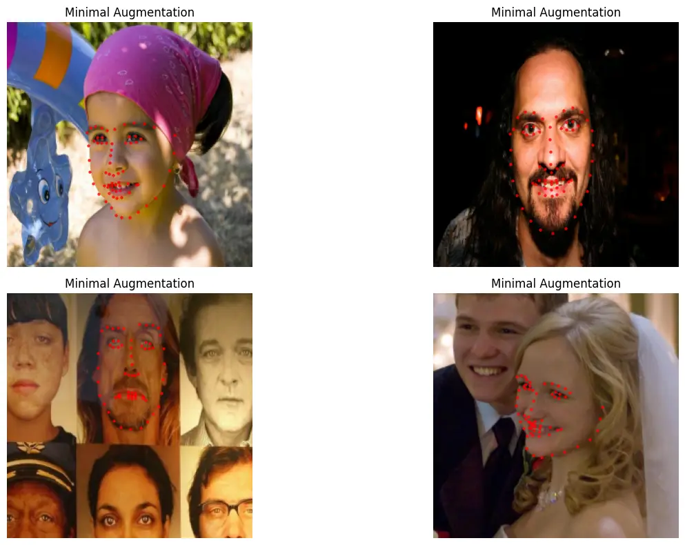
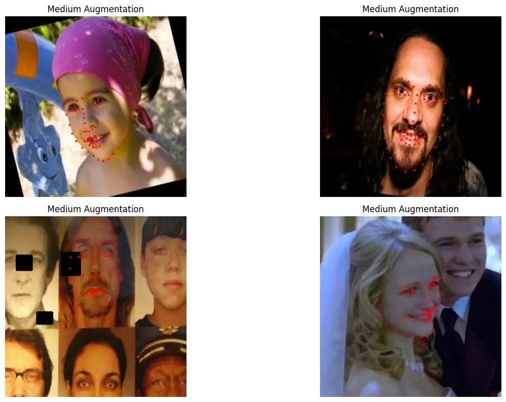
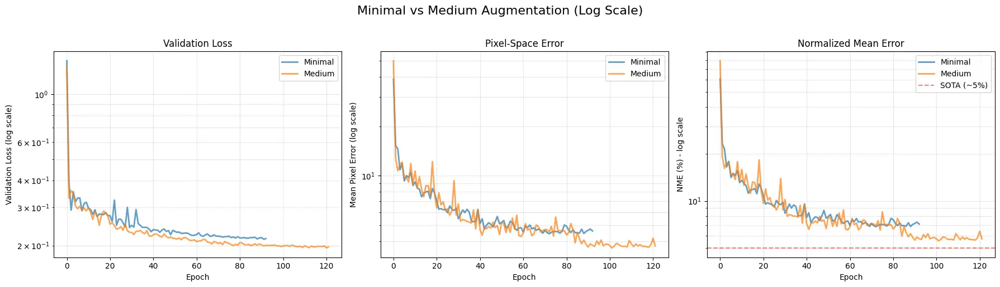
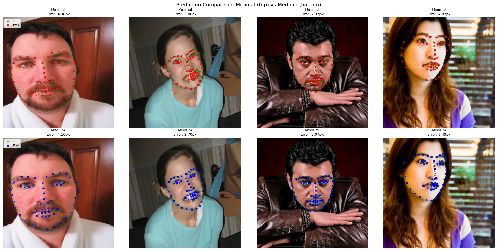

# Understanding Keypoint Label Swapping in Data Augmentation

The complete implementation with all code and visualizations is available in the [notebook](https://albumentations.ai/docs/examples/face-landmarks-tutorial/).

## The Problem

When training models for face landmark detection, there's a subtle but important issue with horizontal flips that's easy to miss.

Consider a simple example: you have a face image with 68 landmarks, where landmark[36] represents the left eye and landmark[45] represents the right eye. The word "left" and "right" here refer to the person's anatomical left and right, not the viewer's perspective.

When you apply a horizontal flip for data augmentation, two things need to happen:
1. The x-coordinates need to flip (standard behavior)
2. The semantic labels need to swap (less obvious)

Standard augmentation handles (1) correctly but not (2). This creates a mismatch between array indices and semantic meaning after augmentation.

## Why This Matters

In landmark detection, the position in the array carries semantic meaning. Your model learns that landmark[36] should be near the left eye, landmark[45] should be near the right eye, and so on. The model builds spatial relationships based on these fixed positions.

After a standard horizontal flip:
- The physical left eye moves to the right side of the image (coordinates change correctly)
- But it's still at position landmark[36] in the array
- For the flipped image, the physical structure at landmark[36] is now the person's right eye, not left
- The semantic meaning has changed, but the label hasn't

This inconsistency means your model sees contradictory training signals: sometimes landmark[36] is on the left side, sometimes on the right, depending on whether the image was flipped.

## The Solution: Label Mapping with Array Reordering

AlbumentationsX introduces a `label_mapping` feature that solves this problem. It does two things:

1. Updates the label (e.g., "left_eye" becomes "right_eye")
2. Reorders the keypoints array so the new position matches the new label

After a flip with label mapping:
- The physical left eye moves to the right side (coordinates flip)
- Its label changes from "left_eye" to "right_eye"
- It moves from position 36 to position 45 in the array
- Now landmark[45] correctly points to what is anatomically the right eye in the flipped image

The model now sees consistent training data: landmark[36] is always the left eye, landmark[45] is always the right eye, regardless of augmentation.

## Implementation

Here's how you define the mapping for 68-point face landmarks:

```python
FACE_68_HFLIP_MAPPING = {
    # Jawline (0-16): mirror across center
    0: 16, 1: 15, 2: 14, 3: 13, 4: 12, 5: 11, 6: 10, 7: 9, 8: 8,
    16: 0, 15: 1, 14: 2, 13: 3, 12: 4, 11: 5, 10: 6, 9: 7,
    # Eyebrows: left (17-21) ↔ right (22-26)
    17: 26, 18: 25, 19: 24, 20: 23, 21: 22,
    26: 17, 25: 18, 24: 19, 23: 20, 22: 21,
    # Nose bridge (27-30): no swap (central)
    27: 27, 28: 28, 29: 29, 30: 30,
    # Nose bottom: left (31-32) ↔ right (34-35), center (33)
    31: 35, 32: 34, 33: 33, 34: 32, 35: 31,
    # Eyes: left (36-41) ↔ right (42-47)
    36: 45, 37: 44, 38: 43, 39: 42, 40: 47, 41: 46,
    45: 36, 44: 37, 43: 38, 42: 39, 47: 40, 46: 41,
    # Outer lips: left ↔ right, keep centers
    48: 54, 49: 53, 50: 52, 51: 51,
    54: 48, 53: 49, 52: 50,
    55: 59, 56: 58, 57: 57,
    59: 55, 58: 56,
    # Inner lips: left ↔ right, keep centers
    60: 64, 61: 63, 62: 62,
    64: 60, 63: 61,
    65: 67, 66: 66,
    67: 65,
}
```

And use it in your augmentation pipeline:

```python
transform = A.Compose([
    A.Resize(256, 256),
    A.HorizontalFlip(p=0.5),
    A.Normalize(mean=[0.485, 0.456, 0.406], std=[0.229, 0.224, 0.225]),
    A.ToTensorV2(),
], keypoint_params=A.KeypointParams(
    format='xy',
    label_fields=['keypoint_labels'],
    remove_invisible=False,
    label_mapping={'HorizontalFlip': {'keypoint_labels': FACE_68_HFLIP_MAPPING}}
))
```

## Experimental Setup

To validate this approach, I trained a U-Net model with ResNet50 encoder on the HELEN dataset (2,330 faces with 68 landmarks). The model predicts heatmaps for each landmark, which are converted to coordinates using soft-argmax.

I compared two augmentation strategies:

**Minimal**: Only horizontal flip with label mapping
```python
augs = [
    A.HorizontalFlip(p=0.5),
    ]
```


*Minimal augmentation: Only HorizontalFlip with label mapping*

**Medium**: 
```python
 # Balanced augmentations with keypoint label swapping
augs = [
    # Basic geometric (with label swapping for symmetric keypoints!)
    A.HorizontalFlip(p=0.5),
    
    # Dropout/Occlusion (HIGH IMPACT - teaches robustness to occlusions)
    A.CoarseDropout(
        num_holes_range=(1, 5),
        hole_height_range=(0.05, 0.15),  # 5-15% of image size
        hole_width_range=(0.05, 0.15),
        fill=0,
        p=0.3
    ),
    
    # Affine transformations
    A.Affine(
        scale=(0.8, 1.2),
        rotate=(-20, 20),
        keep_ratio=True,
        p=0.7
    ),
    
    # Color augmentations (realistic lighting conditions)
    A.OneOf([
        A.ColorJitter(brightness=0.2, contrast=0.2, saturation=0.2, hue=0.1, p=1.0),
        A.PlanckianJitter(mode='blackbody', p=1.0),  # Realistic temperature shifts
    ], p=0.5),
    
    # Image quality degradation (JPEG compression)
    A.ImageCompression(quality_range=(50, 95), compression_type='jpeg', p=0.3),
    
    # Blur and noise (camera effects)
    A.GaussNoise(std_range=(0.02, 0.1), p=0.3),
    A.OneOf([
        A.Blur(blur_limit=3, p=1.0),
        A.MedianBlur(blur_limit=3, p=1.0),
    ], p=0.2),
]
```


## Training Details

Model architecture:
- Encoder: ResNet50 pretrained on ImageNet
- Decoder: U-Net with channels (256, 128, 64, 32, 16)
- Output: 68 heatmaps at 256x256 resolution

Loss function:
- MSE loss for heatmap prediction
- Wing loss for coordinate regression (auxiliary)
- Combined: `loss = mse_loss + 0.1 * wing_loss`

Training setup:
- Optimizer: AdamW (lr=1e-3, weight_decay=1e-4)
- Batch size: 64
- Scheduler: ReduceLROnPlateau (factor=0.5, patience=5)
- Early stopping: 20 epochs without improvement
- Dataset split: 90% train (2,097 images), 10% validation (233 images)

## Results

**Minimal augmentation** (HFlip only):
- Converged in ~93 epochs
- Best NME: 7.08%
- Mean pixel error: 4.59 pixels

**Medium augmentation** (full pipeline):
- Converged in 122 epochs
- Best NME: 5.81%
- Mean pixel error: 3.81 pixels

The medium augmentation achieved a 33% reduction in error compared to minimal augmentation.

For context, state-of-the-art methods on HELEN achieve 3-5% NME, so the medium augmentation result is competitive with a relatively simple architecture.

### Training Curves Comparison


*Comparison of validation loss, pixel error, and NME between minimal and medium augmentation (log scale). Medium augmentation requires more epochs to converge but achieves significantly better final performance.*

### Prediction Quality


*Visual comparison of predictions: Minimal augmentation (top row) vs Medium augmentation (bottom row). Green dots are ground truth, red/blue crosses are predictions. Medium augmentation produces more accurate landmark localization.*

## Key Observations

1. **Augmentation is essentially more data**: Adding augmentations increases the effective dataset size, which requires longer training to converge. The minimal setup needed 110 epochs while medium needed 250+.

2. **CoarseDropout has high impact**: Among the augmentations tested, CoarseDropout (which randomly masks out rectangular regions) provided significant robustness gains. This makes sense as it teaches the model to handle occlusions.

3. **Early stopping is essential**: With complex augmentation pipelines, it's hard to predict convergence time. Early stopping (monitoring validation NME with 20-epoch patience) handles this automatically.

4. **Label mapping is critical**: Without proper label swapping, the model receives inconsistent training signals that degrade performance. This is especially important for symmetric structures like faces.

## Understanding NME

The Normalized Mean Error (NME) metric deserves explanation. It's defined as:

```
NME = (mean_pixel_error / inter_ocular_distance) * 100
```

Where inter_ocular_distance is the distance between the outer corners of the two eyes (landmarks 36 and 45).

This normalization makes the metric scale-invariant. A 5-pixel error on a 100x100 face is much worse than a 5-pixel error on a 500x500 face. By normalizing with inter-ocular distance (which scales with face size), we get a percentage that's comparable across different face sizes and datasets.

## Code Structure

The complete implementation has several key components:

**Heatmap generation**: Convert (x, y) coordinates to Gaussian heatmaps
```python
def generate_heatmaps(landmarks, image_size=256, heatmap_size=256, sigma=8.0):
    # Create 2D Gaussian centered at each landmark
    # Returns tensor of shape [batch, num_keypoints, height, width]
```

**Coordinate extraction**: Extract sub-pixel coordinates from heatmaps
```python
def soft_argmax_2d(heatmaps, temperature=1.0):
    # Apply softmax and compute weighted average of positions
    # Differentiable alternative to argmax
    # Returns tensor of shape [batch, num_keypoints, 2]
```

**Dataset class**: Handles loading and augmentation
```python
class FaceLandmarkDataset(Dataset):
    def __getitem__(self, idx):
        image = cv2.imread(img_path)
        landmarks = np.load(landmark_path)
        keypoint_labels = np.arange(len(landmarks))
        
        transformed = self.transform(
            image=image,
            keypoints=landmarks,
            keypoint_labels=keypoint_labels
        )
        return transformed["image"], transformed["keypoints"]
```

## Practical Considerations

**When to use label mapping**: This feature is essential for any task with symmetric keypoints where array position carries semantic meaning:
- Face landmarks
- Human pose estimation (left/right arm, leg, etc.)
- Animal pose estimation
- Any structured prediction with symmetry

**When you don't need it**: If your keypoints are unordered or you're using a set-based approach (like DETR for object detection), label mapping isn't necessary.

**Computational cost**: The label mapping operation is essentially free - it's just array indexing. The augmentation speed is dominated by image transformations, not label remapping.

## Conclusion

The label mapping feature in AlbumentationsX solves a subtle but important problem in keypoint augmentation. By ensuring array indices always correspond to the same semantic meaning, it provides consistent training signals to the model.

The experimental results demonstrate that:
1. Proper label handling matters for model quality
2. Augmentation significantly improves results (33% error reduction)
3. More augmentation requires longer training but is worth it
4. Simple architectures with good augmentation can achieve competitive results

The code is available at [repository link], including the full training script, visualization tools, and pretrained models.

## References

- HELEN Dataset: http://www.ifp.illinois.edu/~vuongle2/helen/
- Albumentations Documentation: https://albumentations.ai
- Segmentation Models PyTorch: https://github.com/qubvel/segmentation_models.pytorch
- Wing Loss Paper: "Wing Loss for Robust Facial Landmark Localisation with Convolutional Neural Networks" (2018)


