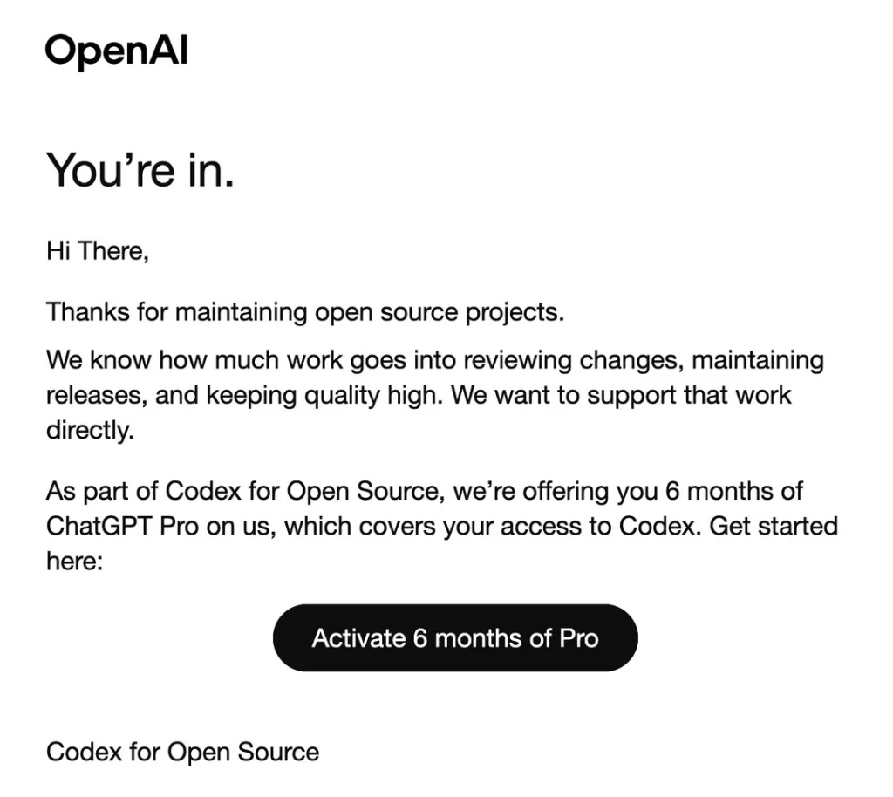
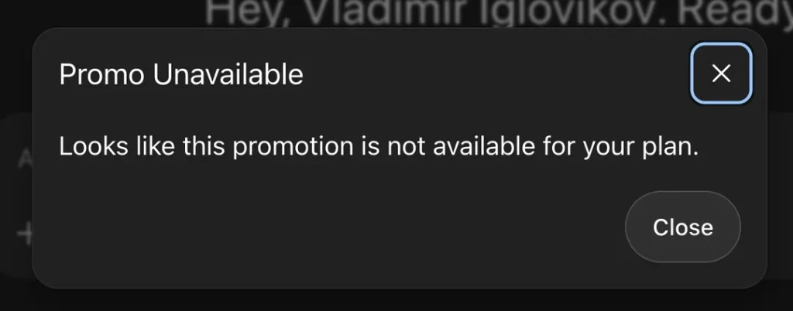

# OpenAI's Support Is an AI. And It Feels Two Generations Behind Their Own Models.

Support tickets at OpenAI are handled by an AI agent, not a person — and the agent's behavior reads like a 2021-era model. It does not track context across turns, it restates program documentation instead of answering account-specific questions, and after several rounds of careful prompting it converges to the same generic template. This was the most surprising part of the experience below, more than the activation bug itself.

## How I Noticed

I applied to the [Codex Open Source Fund](https://openai.com/form/codex-open-source-fund/) for the [Albumentations](https://albumentations.ai) ecosystem. I received an explicit approval email — "You're in" — offering 6 months of ChatGPT Pro. The activation flow then said the promotion was not available for my plan. I opened a support ticket expecting a human, asked progressively narrower questions ("was the benefit provisioned to my account, yes or no?"), and got progressively less specific answers. After four rounds it became clear I was talking to a model.

## Who I Am / Why I Applied

> [Albumentations](https://albumentations.ai) is open-source image-augmentation infrastructure — depended on by approximately 40k public GitHub repositories, cited in 2,403 academic papers, and downloaded approximately 144M times (~6M / month). It is a [NumFOCUS Affiliated Project](https://numfocus.org/sponsored-projects/affiliated-projects); the maintaining entity (Albumentations LLC) is SAM.gov-verified.

I applied to the Codex Open Source Fund for support of this ecosystem.

## What the Fund Advertised vs What Was Offered

The fund's public description on [openai.com/form/codex-open-source-fund/](https://openai.com/form/codex-open-source-fund/):

> We're excited to launch a $1 million initiative supporting open source projects to use Codex CLI and OpenAI models. Applications will be reviewed on an ongoing basis, with projects receiving grants up to **$25,000 in API credits**.

What the approval email actually offered: **6 months of ChatGPT Pro.** No mention of API credits.

The Pro subscription is genuinely useful and I'm grateful for it. But the headline promise of the program is API credits, and API credits are what would actually serve the stated purpose ("supporting open source projects to use Codex CLI and OpenAI models"). Concretely, I want to do a serious side-by-side of Codex CLI vs Cursor on real [Albumentations](https://albumentations.ai) work — that means a lot of model calls across many sessions, which is exactly the workload API credits are designed for and a Pro subscription is not.

So two questions sit on top of the activation issue:

1. Is the Pro offer in place of the advertised API credits, or in addition to them?
2. If only Pro is on offer, is the API-credit half of the program available to apply for separately?

## Timeline

- **Early March 2026** — applied via [openai.com/form/codex-open-source-fund/](https://openai.com/form/codex-open-source-fund/).
- **About 1 month of silence.** Asked a friend at OpenAI to ping internally.
- **April ~12** — received the approval email: "You're in. As part of Codex for Open Source, we're offering you 6 months of ChatGPT Pro on us." Button: "Activate 6 months of Pro."
- **Same day** — clicking the button opened a modal: "Promo Unavailable. Looks like this promotion is not available for your plan."
- **April 13–17** — support thread (case `07653765`), signed "Mayumi, OpenAI Support". Response patterns strongly suggest an AI agent, not a human.
- **In parallel**, attempts to find a human:
  - OpenAI website chatbot — stops responding mid-conversation.
  - OpenAI Discord — asked there.
  - X — pinged [@embirico](https://x.com/embirico), [@reach_vb](https://x.com/reach_vb), [@thsottiaux](https://x.com/thsottiaux), [@romainhuet](https://x.com/romainhuet).
  - [LinkedIn post asking for the right person to contact](https://www.linkedin.com/feed/update/urn:li:activity:7448196634921918464/).
  - [X post about the same](https://x.com/viglovikov/status/2042431024345612410).

## What the Support Model Actually Did

I prompted the support thread the same way I would prompt ChatGPT: precise, structured, narrowing questions with explicit yes/no requests, the literal text of the approval email attached, the case number cited, and the specific contradiction stated plainly.

What came back, across four rounds:

- Restatements of generic program terms.
- Heavy hedging — "may", "could", "typically", "in many cases", "generally means one of the following".
- No per-account verification ("let me check whether this benefit was provisioned to your account") at any point.
- No escalation, no handoff to a human, no "I cannot answer this and am routing you."
- Each round the answers converged toward the same template instead of getting more specific. A current frontier model (including OpenAI's own) handles this kind of multi-turn narrowing without difficulty.

The activation bug is a small thing. The support-loop pattern is the more interesting signal — and the more interesting question is whether anyone inside OpenAI is aware that the model deployed on the support channel feels two generations behind the ones the company sells.

## Proofs

### The approval email

### The activation result

### The full support thread (case `07653765`)

Click to expand the full email exchange

**Support — Mon, Apr 13, 1:36 AM**

> Hello,
>
> Thanks for reaching out to OpenAI support.
>
> I understand you were approved for the Codex Open Source offer but are unable to activate it and are seeing a message that the promotion is not available for your current plan. I can see how confusing this is, especially given the wording of the approval email.
>
> At the moment, the only active Codex related promotions are for Business users and students. Codex access depends on your current ChatGPT plan, and promotions can only be applied if certain conditions are met. In many cases, having an active Plus subscription can prevent a promotion from being applied, especially if it is intended for specific users or account types.
>
> As a next step, you may want to check if you are redeeming the offer on the same account that has an active subscription, or try accessing Codex features directly within your current plan. If you recently made any changes to your subscription, it may also help to try again after the current billing cycle updates.
>
> If the promotion still does not apply, it is likely due to eligibility requirements tied to the offer. We recommend keeping an eye out for future promotions that may better match your account.
>
> We appreciate you taking the time to reach out, and please feel free to let us know if you have any questions.
>
> Best, Mayumi — OpenAI Support

**Me — Mon, Apr 13, 6:28 PM**

> Hi Mayumi,
>
> Thank you for the reply. I think there may be a misunderstanding about which program I applied to.
>
> My application was for the Codex Open Source Fund at OpenAI, described as: "We're excited to launch a $1 million initiative supporting open source projects to use Codex CLI and OpenAI models. Applications will be reviewed on an ongoing basis, with projects receiving grants up to $25,000 in API credits."
>
> This appears to be a separate open-source support program. In the fund description, I do not see any mention that it is limited to students or business users.
>
> My application was for support of the broader Albumentations ecosystem, including:
>
> - Albumentations (legacy project): 15k+ GitHub stars, ~140M total downloads, ~5M monthly downloads
> - AlbumentationsX (actively developed successor)
> - albucore: ~41M total downloads, ~4.2M monthly downloads
> - the website, documentation, UI tool, and benchmarks that support the ecosystem
>
> Could you please clarify:
>
> 1. Whether the Codex Open Source Fund is indeed separate from the student/business promotions you referenced
> 2. Whether my account was approved for the Open Source Fund specifically
> 3. If yes, how the credits are supposed to be activated when the account currently shows that the promotion is not available for my plan
> 4. If no, whether the approval email I received was sent in error
>
> If helpful, I can also forward the original approval email so your team can verify the exact offer and the account it was associated with.
>
> Best regards, Vladimir Iglovikov

**Support — Tue, Apr 14, 1:34 AM**

> Hello,
>
> Thanks for reaching back to OpenAI Support.
>
> I understand you're trying to clarify your approval for the Codex Open Source Fund and how to activate the benefits, especially since your account is showing that the promotion is not available. I can see how this situation is confusing given the approval message you received.
>
> Based on the Codex for Open Source program terms, this initiative is separate from standard promotions and does not always apply as a direct change to your ChatGPT plan. Benefits under this program can vary and may include different types of access, such as API credits or limited-duration features, depending on your specific approval.
>
> These benefits are also subject to eligibility, activation steps, and timing, and may expire if not redeemed within the specified period.
>
> If your approval included a specific redemption link, code, or activation instructions, please make sure those steps were followed exactly, as the benefit will only apply when activated through the correct flow.
>
> If the promotion is not applying to your account, it may be due to eligibility conditions, activation requirements, or the benefit being structured differently than a plan upgrade.
>
> We appreciate your understanding, and please feel free to reach out if you have any other questions.
>
> Best, Mayumi — OpenAI Support

**Me — reply**

> Hi Mayumi,
>
> Thank you for the reply. I understand the general explanation, but it still does not clarify my specific case. My question is not about the program in general. It is about the actual status of my application and account.
>
> At this point, I need a concrete answer to the following:
>
> 1. Was my application approved for the Codex Open Source Fund, yes or no?
> 2. If yes, what exactly was approved — for example, API credits, a redemption flow, or some other benefit?
> 3. If API credits were approved, to which account/workspace were they assigned, and where can I see them?
> 4. If no credits were assigned yet, what exact step is still pending, and on whose side?
> 5. If the approval email was sent in error, please confirm that explicitly.
>
> To avoid further confusion: I am not asking whether this program changes my ChatGPT plan. I am asking whether my application for the Codex Open Source Fund resulted in any approved benefit on OpenAI's side, and if so, where that benefit is reflected.
>
> Please check the internal status of my application and reply with the specific result for this case, rather than the general program description. If needed, I can forward the approval email again so it can be matched against the correct account.
>
> Best regards, Vladimir Iglovikov

**Support — reply**

> Hello Vladimir,
>
> Thanks for your detailed follow-up, I understand you're looking for a clear and specific answer about the status of your application. I can see how important it is to get a direct clarification here.
>
> To address your questions as clearly as possible:
>
> Submitting an application to the Codex Open Source Fund does not automatically result in an active benefit on your account. Even when applications are reviewed, approvals are applied through specific activation steps such as credits, access, or a redemption flow, and these must be completed or successfully provisioned before anything appears on your account.
>
> If an application is approved, the benefit is typically activated through a defined process such as a redemption link, API credit allocation, or account level enablement. If that activation step is not completed or does not apply to the current account setup, the benefit may not appear.
>
> If no benefit is visible on your account, it generally means one of the following:
>
> - The application did not meet eligibility criteria
> - The benefit was not assigned to this specific account or workspace
> - The activation step was not completed or has expired
> - The timing of the rollout or allocation has not yet reached your account
>
> Since this is automatically reviewed by our system, if no follow-up or activation details were provided beyond the initial message, it is most likely that the application did not result in an applied benefit for this account.
>
> As a quick recommendation, please double check if your approval email included a specific redemption link or instructions and ensure it was used with the same account. It may also help to verify whether you have access to any API credits in your OpenAI account dashboard.
>
> We understand this may not be the outcome you were expecting, and we appreciate the context you shared about your work. At this time, there is no further action required on your side.
>
> Best, Mayumi — OpenAI Support

**Me — reply**

> Hi Mayumi,
>
> Thank you for the reply. I now want to point to the exact approval email I received, because it appears to contradict the conclusion in your last message.
>
> The email from the Codex team explicitly says:
>
> - "You're in."
> - "As part of Codex for Open Source, we're offering you 6 months of ChatGPT Pro on us."
> - It includes a button: "Activate 6 months of Pro."
>
> So this does not read like a generic application acknowledgment or a case where no benefit was approved. It reads like an explicit approval with a specific benefit and activation flow.
>
> Because of that, I need a direct answer to the following:
>
> 1. Was this email legitimately issued for my account, or was it sent in error?
> 2. If it was legitimately issued, was 6 months of ChatGPT Pro actually provisioned for my account?
> 3. If it was provisioned, why does the activation flow say that the promotion is not available for my current plan?
> 4. If it was not provisioned correctly, can this be escalated to the team responsible for the Codex for Open Source activation flow so they can either apply the 6-month Pro benefit correctly, or confirm in writing that the approval email was sent in error?
>
> To be clear, I am not asking about general program terms anymore. I am asking about this specific approval email and whether the benefit stated in it was actually attached to my account.
>
> Please escalate this case to the appropriate internal team if support cannot directly verify provisioning status.
>
> Best regards, Vladimir Iglovikov

**Support — reply**

> Hello,
>
> Thanks for your thoughtful follow-up, I understand you're looking for a clear answer regarding the approval email and the 6 months of ChatGPT Pro mentioned. I can see how confusing this is, especially given how explicit the wording of that email appears.
>
> You're right that the message you received sounds like an approval. However, based on how the Codex for Open Source program works, that type of email does not always guarantee that the benefit has been successfully applied to your account.
>
> The program is designed to support open source maintainers, and benefits can include API credits, ChatGPT Pro with Codex access, or selective access to additional features. These are granted based on eligibility and may depend on factors such as your project's role in the ecosystem and how the benefit is provisioned.
>
> In some cases, an email like the one you received may be:
>
> - Sent before all eligibility checks or provisioning steps are completed
> - Intended for a specific activation flow that must be completed under certain conditions
> - Not compatible with the current state of your account, for example if you already have an active Plus subscription
>
> Since you are currently on ChatGPT Plus, this can sometimes prevent certain promotions from being applied, which may explain why you are seeing the message that the promotion is not available for your plan.
>
> At this point, the most likely scenarios are:
>
> - The benefit was not fully provisioned to your account
> - The activation flow is not compatible with your current subscription
> - Or the email was sent before final eligibility or provisioning was completed
>
> As a recommendation, you may try accessing the activation link while logged into the intended account and, if possible, after ensuring there are no active conflicting subscriptions. If the issue persists, it would indicate that the benefit was not successfully applied to this account.
>
> We understand this is not fully aligned with what the email suggested, and we appreciate you raising this clearly. Your feedback is valuable and helps improve how these programs are communicated.
>
> Best, Mayumi — OpenAI Support

## Status

Still unresolved as of today. Posted here for visibility, not for a refund. If anyone at OpenAI happens to read this and can either:

- escalate the activation issue so the offered benefit actually applies, or
- clarify how to obtain the API credits the fund publicly advertises, or
- pass a note to whoever owns the support-channel model that it's a generation or two behind the public-facing ones —

…that would all be useful. My contact details are in the [author profile](https://github.com/ternaus).
